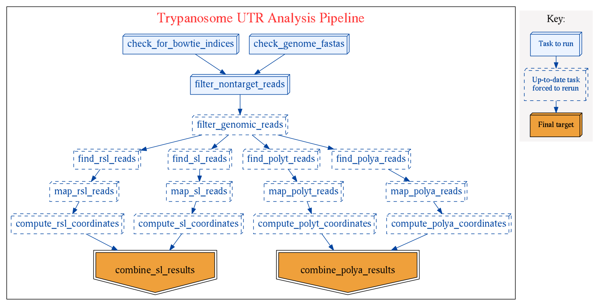

UTR Analysis Pipeline
=====================

Overview
--------

Pipeline for analyzing a set of RNA-Seq reads to determine 5' and
3'UTR structure including the locations of all spliced leader acceptor sites
and poly-A tail acceptor sites.

The pipeline makes use of Tophat for mapping reads, and Ruffus for pipeline
flow management.

### Input

- RNA-Seq reads (FASTQ)
- Genome sequence (FASTA)
- Genome annotation including CDS coordinates (GFF)
- Spliced leader sequence (for 5'UTR/SL analysis)
- (**Optional**) Genome sequence and annotations for a second species that is
  not of interest but may be used to filter out reads, e.g. in a mixed
  transcriptome study (fasta)

### Goals

#### Spliced leader analysis

Generate a table containing the location of primary and alternative
trans-splicing acceptor sites for each gene (and condition/sample) along with
the usage frequency for acceptor sites.

The basic steps followed are:

1. Given SL sequence, find all paired reads containing >= n bases of the SL
   sequence (current default n=10).
2. Remove reads where matching sequence is internal (Optional; although in
   theory all SL-containing reads should have the SL fragment at the upstream
   end of the read, in practice there are many chimeric reads with unrelated
   fragments further upstream resulting in valid internal SL sequences.)
3. Remove SL portion of sequence and map back to original genome -- site of
   mapping indicates location of splice acceptor site.

#### Polyadenylation site analysis

Similarly, this pipeline attempts to detect reads containing a portion of a
Poly(A) tail and use this information to determine corresponding
polyadenylation sites in the genome.

The process used here mirrors that applied for trans-splicing acceptor site
detection, except that instead of using a spliced leader sequence, reads are
search for long strings of adenines (or thymines).

Requirements
------------

### Software

- Python 2.7
- [Samtools](http://www.htslib.org/) (>= 1.3)
- [Tophat](https://ccb.jhu.edu/software/tophat/index.shtml)

### Python libraries

- [Ruffus](http://www.ruffus.org.uk/)
- [BioPython](http://biopython.org/wiki/Main_Page)
- [bcbio-gff](https://pypi.python.org/pypi/bcbio-gff)
- [pysam](http://pysam.readthedocs.org/en/latest/)
- [Distance](https://pypi.python.org/pypi/Distance/)

To install these Python dependencies using pip, run:

    pip install ruffus biopython bcbio-gff pysam distance backports.lzma

Usage
-----

### Overview

    usage: utr_analysis.py [-h] -i INPUT_READS -d BUILD_DIRECTORY -f1
                        TARGET_GENOME [-f2 HOST_GENOME] -g1 TARGET_GFF
                        [-g2 HOST_GFF] -s SPLICED_LEADER
                        [--exclude-internal-sl-matches]
                        [--exclude-internal-polya-matches]
                        [--minimum-trimmed-length MINIMUM_TRIMMED_LENGTH]
                        [--max-dist-from-edge MAX_DIST_FROM_EDGE]
                        [-m MIN_SL_LENGTH] [-p MIN_POLYA_LENGTH]
                        [-w WINDOW_SIZE] [-x MINIMUM_DIFFERENCES]
                        [--num-threads NUM_THREADS]
                        [--num-threads-tophat NUM_THREADS_TOPHAT]

    Spliced Leader and poly-adenylation site analysis

    optional arguments:
    -h, --help            show this help message and exit
    -i INPUT_READS, --input-reads INPUT_READS
                            RNA-Seq FASTQ or gzipped FASTQ glob string ora txt
                            file containing filepaths to the samplesto be used
    -d BUILD_DIRECTORY, --build-directory BUILD_DIRECTORY
                            Directory to save output to
    -f1 TARGET_GENOME, --target-genome TARGET_GENOME
                            Genome sequence FASTA filepath for target species
    -f2 HOST_GENOME, --host-genome HOST_GENOME
                            Genome sequence FASTA filepath for species to be
                            filtered out prior to mapping. (optional)
    -g1 TARGET_GFF, --target-annotations TARGET_GFF
                            Genome annotation GFF
    -g2 HOST_GFF, --host-annotations HOST_GFF
                            Genome annotation GFF
    -s SPLICED_LEADER, --sl-sequence SPLICED_LEADER
                            Spliced leader DNA sequence
    --exclude-internal-sl-matches
                            Only allow matches with the SL at the upstream end of
                            a read.
    --exclude-internal-polya-matches
                            Only allow matches with the Poly(A) tail at the
                            downstream end of a read.
    --minimum-trimmed-length MINIMUM_TRIMMED_LENGTH
                            The minimum read length allowed after
                            SL/Poly(A)trimming has been performed. (default=18)
    --max-dist-from-edge MAX_DIST_FROM_EDGE
                            For unanchored searches, what is the maximum distance
                            from the edge of the read for a feature match to be
                            considered (default=unlimited).
    -m MIN_SL_LENGTH, --min-sl-length MIN_SL_LENGTH
                            Minimum length of SL match (default=6)
    -p MIN_POLYA_LENGTH, --min-polya-length MIN_POLYA_LENGTH
                            Minimum length of Poly-A match (default=6)
    -w WINDOW_SIZE, --window-size WINDOW_SIZE
                            Number of bases up or downstream of feature to scan
                            for related genes (default=50000)
    -x MINIMUM_DIFFERENCES, --minimum-differences MINIMUM_DIFFERENCES
                            Minimum number of differences from genomic sequence
                            for a hit to be considered real. (default=2)
    --num-threads NUM_THREADS
                            Number of threads to use (default=4).
    --num-threads-tophat NUM_THREADS_TOPHAT
                            Number of threads to use for each Tophat run.
                            (default=1)

### Input read filename requirements

Each input sample file must include the pair-end read number (e.g. "_1" or
"_R1") and a the file extension ".fastq" in all lower-case. Optionally, the
files may be gzip-compressed with the file extension ".fastq.gz".

For example, a valid directory structure may look like:

    ├── dir01
    │   ├── rnaseq_sample01_1.fastq
    │   └── rnaseq_sample01_2.fastq
    ├── dir02
    │   ├── rnaseq_sample02_1.fastq
    │   └── rnaseq_sample02_2.fastq
    └── etc

or:

    ─ samples
            ├── rnaseq_sample01_1.fastq
            ├── rnaseq_sample01_2.fastq
            ├── rnaseq_sample02_1.fastq
            ├── rnaseq_sample02_2.fastq
            └── etc

### Example 1

Scan *T. cruzi* reads, using the default arguments and filtering out reads that
align to the human genome

    utr_analysis.py                                                \
       -i "$RAW/tcruzir21/*/processed/*.filtered.fastq.gz"         \
       -s AACTAACGCTATTATTGATACAGTTTCTGTACTATATTG                  \
       -f1 TriTrypDB-27_TcruziCLBrenerEsmeraldo-like_Genome.fasta  \
       -f2 hg38.fasta                                              \
       -g1 TrypDB-27_TcruziCLBrenerEsmeraldo-like.gff              \
       -g2 Homo_sapiens.GRCh38.83.compat.gtf

### Example 2

Below is a more complicated command with several of the parameters set to
non-default values.

    utr_analysis.py                                                           \
       -i $RAW/lmajor/input/\*/processed/\*.fastq.gz                          \
       -f1 $REF/TriTrypDB-9.0_LmajorFriedlin_Genome.fasta                     \
       -f2 $REF/mm10.fasta                                                    \
       -g1 $REF/lmajor_friedlin/annotation/TriTrypDB-9.0_LmajorFriedlin.gff   \
       -s AACTAACGCTATATAAGTATCAGTTTCTGTACTTTATTG                             \
       --min-sl-length 4                                                      \
       --min-polya-length 4                                                   \
       --minimum-differences 3                                                \
       --num-threads 2                                                        \
       --build-directory $SCRATCH/utr_analysis/lmajor                         \
       --exclude-internal-polya-matches

Note that in the above example, the wildcard ("glob") string specifying the
location of input reads, the asterisks have been escaped using a backspace.
This is necessary if you do not quote the expression as was done for the
previous example.

Background
----------

### Spliced Leader

#### Organization in the genome

- Trypanosome genomes contain tandem arrays of several hundred SL genes from
  which the SL is transcribed.
- "SL repeat" = SL RNA and a non-transcribed spacer.
- The SL exon sequence is highly conserved, while the spacer regions are
  highly variable and sometimes used to differentiate closely related tryp.
  species.

#### SL RNA

- The SL mini-exon is part of a larger SL RNA transcript which is thought to
fold into a 3 stem-loop structure, possibly with varying configurations
(Gibson).

#### SL exon

SL = SL exon = SL mini-exon

##### T. cruzi (McCarthy-Burke et al; 1989)

> AACTAACGCTATTATTGATACAGTTTCTGTACTATATTG

##### L. major (Rastrojo et al. 2013)

> AACTAACGCTATATAAGTATCAGTTTCTGTACTTTATTG

Pipeline Overview
-----------------

Below is an overview of the steps executed in the UTR analysis pipeline. The
flow chart was generated using the `pipeline_printout_graph` function from
Ruffus.

References
----------

- Agabian, N. (1990). Trans splicing of nuclear pre-mRNAs. Cell, 61(7),
1157–1160. doi:10.1016/0092-8674(90)90674-4

- Gibson, W., Bingle, L., Blendeman, W., Brown, J., Wood, J., & Stevens, J.
(2000). Structure and sequence variation of the trypanosome spliced leader
transcript. Molecular and biochemical parasitology, 107(2), 269–77. Retrieved
from http://www.ncbi.nlm.nih.gov/pubmed/10779603

- McCarthy-Burke, C., Taylor, Z. a, & Buck, G. a. (1989). Characterization of
the spliced leader genes and transcripts in Trypanosoma cruzi. Gene, 82(1),
177–89. Retrieved from http://www.ncbi.nlm.nih.gov/pubmed/2684773

- Leo Goodstadt (2010). Ruffus: a lightweight Python library for computational
pipelines. Bioinformatics 26(21): 2778-2779

